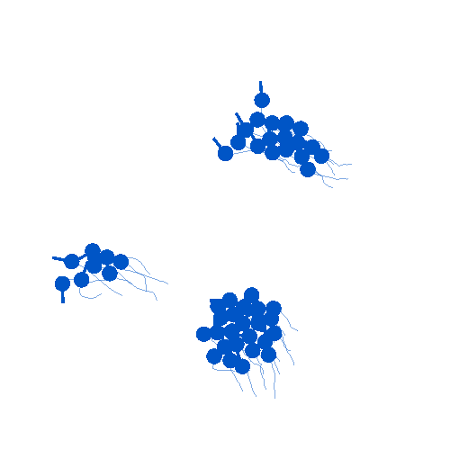

# Modeling Social Distancing with Reinforcement Learning

## Abstract
**TODO: Gets rewriten at the end**

*This study investigates the emergence of social distancing behaviors in artificial agents using a reinforcement learning (RL) framework. Agents interact in a two-dimensional environment and learn to avoid infected individuals to minimize disease transmission. Drawing inspiration from the adaptive behaviors of ants, agents exchange health information and adjust their behavior accordingly. Initial results demonstrate that agents trained with a basic reward policy show increased separation between healthy and infected individuals, as observed through network metrics such as modularity and clustering. This work highlights the potential of RL in modeling disease dynamics and social distancing strategies.*  

## Introduction
The spread of infectious diseases is a significant challenge in both human and animal populations, prompting natural and artificial systems alike to develop mechanisms for minimizing transmission. Social distancing has emerged as a common adaptive behavior in nature, where organisms avoid close contact with infected individuals to protect themselves and their groups. This phenomenon has been observed across a variety of species and environments, suggesting it provides an evolutionary advantage in mitigating disease transmission risks. In response to the COVID-19 pandemic, social distancing also became a key public health strategy for humans, sparking interest in understanding how such behaviors might emerge and evolve autonomously in artificial agents.

Modeling disease transmission and social distancing behaviors in simulated environments can provide insights into the underlying dynamics of these processes, as well as offer potential applications in fields such as epidemiology, robotics, and swarm intelligence. Traditional approaches often rely on predefined rules to drive agent behaviors, limiting the complexity and adaptability of emergent patterns. By contrast, reinforcement learning (RL) provides a flexible framework where agents learn to navigate environments based on reward structures, allowing for more organic, adaptive behaviors that evolve in response to environmental pressures.

In this study, we aim to model social distancing behaviors using a reinforcement learning approach inspired by natural systems. Agents will learn to minimize disease transmission within a two-dimensional environment by adapting their interactions based on health information they exchange with one another. We will build on existing multi-agent reinforcement learning frameworks, specifically those designed for predator-prey dynamics, to simulate agent behavior under disease-spread conditions. This setup will allow us to explore how reward structures and network adaptations can lead to emergent social distancing behaviors, where agents autonomously avoid infected individuals.

Through our model, we hope to deepen our understanding of how social distancing behaviors emerge and to contribute to the broader field of adaptive multi-agent systems. Ultimately, this research may inform both theoretical models of disease transmission and practical applications in areas requiring coordinated group behavior, such as swarm robotics or public health simulations.

## Related Work
In the article Predator–prey survival pressure is sufficient to evolve swarming behaviors \cite{li2023predator}, the authors use a reinforcement learning (RL) approach to model predator and prey behaviors within a cooperative–competitive multi-agent RL framework. Here, predator agents receive rewards for successfully catching prey, while prey agents receive rewards for avoiding capture and staying alive. This approach contrasts significantly with traditional behavior modeling, where predefined rules are often used to drive agents toward expected behaviors. Such rule-based models, however, can fail to capture the complexity and adaptability of real-world dynamics. In contrast, reinforcement learning only presents rewards that encourage or discourage certain actions, allowing for more organic and adaptive behavior development. Through this predator-prey framework, the authors observed emergent behaviors, such as flocking and swarming among prey agents and dispersion tactics among predators. These findings suggest that RL-based approaches can effectively foster diverse and adaptive group behaviors. In our work, we aim to build on this method to model disease spread, adjusting the agent parameters and reward mechanisms to simulate social distancing behaviors.

The complexities of disease spread and natural social distancing behaviors are further explored in Infectious diseases and social distancing in nature \cite{stockmaier2021infectious}. This study examines social distancing as an adaptive response to disease across various animal species, both human and non-human. Social distancing behaviors can emerge as precautionary actions taken by healthy individuals or as physiological responses in infected individuals. The authors analyze the underlying mechanisms driving these behaviors in both infected and non-infected subjects, highlighting how natural populations instinctively modify social interactions to mitigate disease transmission.

Building on this, Romano et al. (2022) in The trade-off between information and pathogen transmission in animal societies \cite{romano2022tradeoff} argue that social distancing alone may be insufficient to control disease spread. They note that individuals in a population inherently rely on information exchange, which conveys significant adaptive benefits. This article discusses the balance animals must strike between maintaining necessary social connections and minimizing infection risk, proposing that animals develop “network plasticity” as they weigh the costs and benefits of each social interaction. These trade-offs in social behavior offer insights that are highly relevant for modeling disease spread, as they underscore the complex motivations behind individual actions within a population.

Together, these studies provide essential frameworks and insights into adaptive behavior modeling under environmental pressures. Our work will leverage these principles by employing a reinforcement learning model that integrates disease spread and social distancing, aiming to simulate the interplay of agent interactions and disease transmission dynamics.

## Methodology

### Problem Definition

Our objective is to model the spread of infectious diseases within a simulated population of agents that can move freely in a two-dimensional environment and interact with one another. The primary goal is to minimize disease spread by limiting interactions among agents. To achieve this, agents will exchange information about their health status, learning to adjust their behavior to avoid infected peers based on the information they receive.

### Disease Spread Modeling

The study of Lasius niger ants \cite{Stroeymeyt2018} reveals an intriguing natural strategy for controlling disease spread. When exposed to the fungal pathogen Metarhizium brunneum, these ants dynamically alter their social network structure to reduce transmission risk. Rather than merely avoiding infected individuals, the entire colony adapts its social interactions to limit disease spread.

Both infected and uninfected ants exhibit adaptive behaviors: infected ants spend more time outside the nest, reducing exposure to healthy nest mates, while uninfected ants increase their spatial distance from others, particularly those exposed to the pathogen. These behavioral changes enhance the network’s modularity, creating compartments within the social structure that contain the spread of infection.

We will incorporate similar adaptive behavioral adjustments into a reinforcement learning model to study disease transmission dynamics. Agents will be rewarded for exchanging information about their health status and penalized for close contact with infected individuals, thereby promoting social distancing behaviors.

Additionally, the paper suggests that low-level exposure to pathogens may have adaptive benefits. Future model improvements may explore nuanced reward and penalty schemes based on varying exposure levels, as well as the potential for agents to develop immunity through controlled exposure. This would allow for a deeper exploration of the trade-offs between information exchange and disease transmission.

### Simulation Environment

This study employs a multi-agent reinforcement learning (RL) framework, adapted from the environment developed by Li et al. (2023) \cite{li2023predator}. The simulation takes place in a two-dimensional continuous space with periodic boundary conditions, meaning that agents crossing one edge of the square environment reappear on the opposite edge, retaining their velocity.

Agents are modeled to resemble ants (changed from unicycles like in \ref{fig:main_figure}), with their body consisting of three connected circles (the back circle being slightly larger) and six legs. Their behavior is driven by a combination of active and passive forces. Active forces, controlled by the agents, include a forward movement force ($aF$) aligned with their heading direction and a rotational force ($aR$) enabling changes in heading. Passive forces, inherent to the environment, include drag force ($Fd$), simulating resistance opposing the agent's velocity, and repulsive force ($Fa$), which prevents agents from overlapping by pushing them apart. At each simulation step, the agents' positions and velocities are updated by summing all acting forces, with the dynamics governed by:

$$ \dot{x} = v, \quad \dot{v} = \frac{ha_F + F_d + F_a}{m}, \quad \dot{\theta} = a_R $$  

where $x$ is the agent's position, $v$ its velocity, $\theta$ its heading angle, $h$ the unit vector for heading direction, and $m$ the agent's mass. The ant-like design, illustrated in Figure~\ref{fig:main_figure}, enhances realism while preserving the underlying principles of agent dynamics.

 

To tailor the framework to our objectives, several modifications were implemented. These include:
- Agent visualization (unicycle to ant) and movement parameters (more "ant-like").
- Agent perception includes health status of the perceived agents (based on FoV).
- Keeping track of agent interactions, used for network evaluation.
- Redefine the reward policy to align with our disease-spread mitigation goals.

### Reward Policy

Our initial reward policy aimed to produce social distancing patterns in agent behavior is based on direct collisions between agents as the primary form of information exchange. Collisions between agents of the same status (healthy-healthy or infected-infected) were rewarded to encourage grouping behavior. In contrast, collisions between agents of different statuses (healthy-infected or vice versa) were penalized to discourage close contact to limit disease spread.

The above mention basic reward policy is demonstrated in isolation with all healthy agents in figure \ref{fig:demo}. On the left figure we penalized each agent upon collision with a $-1$ reward, while on the right figure we rewarded each colliding agent with a $+1$ reward. This demonstrates how a very simple change in the reward policy effects the learned behavior.

 

**TODO: diminishing reward gets removed (not used), but we should mention what we tried**
~~Building on this foundation, we introduced a \textbf{diminishing reward system} to refine agent behavior further. This system rewarded agents for diverse interactions while penalizing risky collisions. To prevent excessive rewards from repeated interactions between the same agents, we incorporated a diminishing factor based on recent interactions:~~
$$
\mathrm{reward}(a, b) = \begin{cases}
    -\lambda & \text{if } sick(a) \neq sick(b) \\ 
    +\sigma * \gamma (1 - recent(a,b)) & \text{otherwise.}
\end{cases}
$$

~~Here, \texttt{recent(a,b)} is initialized to $1$ upon interaction and decreases by a factor of $0.9$ at each step. This mechanism ensures diminishing rewards for repeated collisions, encouraging diverse and meaningful interactions that better reflect real-world dynamics.~~

To further enhance agent behavior, we introduced optional reward components that address specific aspects of agent-environment dynamics. These additions allow for greater adaptability to different scenarios:

1. **Wall Collision Penalty** $\rightarrow$ In non-periodic environments, where agents encounter boundaries, a wall collision penalty discourages agents from colliding with walls:
    $$
    \mathrm{reward}(a) = \begin{cases}
        -\lambda & \text{if a collides with any wall}\\ 
        0 & \text{otherwise.}
    \end{cases}
    $$
2. **Control Penalty** $\rightarrow$ To mimic energy consumption during movement, a control penalty was introduced. This reward is proportional to the magnitude of the agent’s control inputs ($aF$ for forward force and $aR$ for rotational force), encouraging agents to exhibit conservative movement:
    $$
    \text{reward}(aF, aR) = -(\alpha |aF| + \beta |aR|)
    $$

These optional components provide additional flexibility to tailor agent behavior for specific objectives while preserving the simplicity and general applicability of the core reward system. Together, the diminishing reward mechanism and optional components have demonstrated their effectiveness in producing well-performing agents, with interaction networks resembling real-world examples. Ant behavior continues to serve as a baseline for comparison, validating the model's adaptability across species and scenarios.

**TODO: extra task improves results, explain how the task rewards agents**
Introducing an external task can improve agent performance by adding complexity that better reflects real-world dynamics and it enhances the model’s ability to evaluate and simulate realistic agent interactions and responses to disease transmission. 
The external task we chose involves agents alternating between touching the left and right walls. At initialization, each agent is randomly assigned a task to either touch the left or right wall. Agents are rewarded with +0.1 for moving in the correct direction and +1 for successfully touching the assigned wall. Once the agent touches the correct wall, its task is flipped to the opposite wall, encouraging the agent to continually adapt its movement strategy.

## Results

**COMMENT: Moved evaluation measures to results and directly combined it with our results, IMO it flows/reads better this way $\rightarrow$ explain the evaluation measure, present result, explain/argument result**

To evaluate whether social distancing patterns emerge in agent behavior, we transform agent interactions into a network and analyze its structure, following approaches demonstrated in Stroeymeyt et al. (2018) \cite{Stroeymeyt2018}. Throughout each evaluation step, interactions between agents are tracked and recorded in an $n \times n$ interaction matrix, where $n$ is the total number of agents. Two agents are considered to be interacting upon collision. At the end of an evaluation run, this interaction matrix is normalized to construct the network. Nodes in the network represent agents, and edges are created between nodes if their interaction value exceeds a specified threshold ($0.01$). The actual values from the interaction matrix are used as edge weights, and each node is annotated with the health status of the corresponding agent.

We tested our trained model by evaluating it on an episode of 5000 steps with both a random untrained network and a trained network. For each case, we constructed a network of all the interactions throughout the episode, which is displayed in Figure \ref{fig:nets_unfiltered}. In the network visualizations, healthy agents are colored blue, and infected agents are colored orange.

**TODO: the following paragraph needs to be included better or deleted**

In the random network, no clear structure is apparent. However, in the learned network, a separation begins to emerge, with infected agents interacting less with healthy ones, but still interacting with other infected agents. This behavior aligns with our expectations. The structure becomes more pronounced when we filter the network by keeping only edges with weights greater than 0.2, representing significant interactions. The filtered network is shown in Figure \ref{fig:filtered_net}.

")

This network is then used to calculate appropriate network measures such as clustering, modularity (between infected and non-infected), network density and more. This allows us to get a better understanding of how agents are interacting with one another. We expect all of the mentioned metrics to increase as same health status agents interact more between themselves.

In the filtered network, it is evident that infected agents interact significantly less with healthy agents. To gain deeper insights into these interactions and assess metrics beyond visual inspection, we analyzed key network properties relevant to pathogen transmission. Modularity increased from -0.0005 (random) to 0.25 (trained), reflecting greater separation between groups and denser clusters. This trend is reinforced by a rise in clustering values from 0.056 (random) to 0.066 (trained). These changes suggest the emergence of basic social distancing behaviors, with infected and healthy agents reducing their interactions. According to \cite{
@article{volz2011effects,
  title={Effects of heterogeneous and clustered contact patterns on infectious disease dynamics},
  author={Volz, Erik M and Miller, Joel C and Galvani, Alison and Ancel Meyers, Lauren},
  journal={PLoS computational biology},
  volume={7},
  number={6},
  pages={e1002042},
  year={2011},
  publisher={Public Library of Science San Francisco, USA}
}}, both of these propertie serve to reduce the infection spread.

**DONE: more text regarding the following difference graph (the +/- bar graph)**
To investigate pathogen-induced changes in network properties, we utilized our best-performing model and conducted 10 experiments. In each experiment, we initially designated individuals to be infected and performed a baseline evaluation episode with 10,000 steps, during which no individuals were actually infected. Metrics such as clustering, modularity, and network efficiency were recorded. Subsequently, the designated individuals were infected, and the evaluation was repeated. We then calculated the differences in these metrics before and after infection. The results, presented in \ref{fig:induced_changes}, show a significant increase in modularity, as the infected agents segregated from the healthy population. Additionally, network efficiency decreased, indicating an increase in the shortest paths within the network, which is consistent with reduced pathogen spread. Contrary to our expectations, clustering also decreased. This anomaly can be attributed to the initial absence of infected agents, leading to a highly connected network with a high clustering coefficient of 0.138 due to the agents’ tendency to form dense groups.

**TODO: image of metrics differences**

**TODO: change the paragraph to be more inline with our observations (grouping/"filtering" of sick agents)**

Emergent social distancing behavior should also be clearly observable in the simulation visualization. We expect healthy agents to avoid infected ones, and vice versa. This behavior will be especially evident if we increase the agent density within the environment. In such cases, we should observe infected agents becoming isolated, forming empty regions around them, while healthy agents fill the remaining space in the simulation.

**TODO: update image with latest model (frame where sick agents get grouped) $\rightarrow$ probably best to do frame 1 of sim and last frame of sim**

**TODO: fix to argument better whats going on**

Figure \ref{fig:trained_viz} visualizes a simulation of our best-performing policy. The orange ants represent infected ants, while the black ants represent healthy ones. Although this figure appears to indicate the behavior described by the network statistics (with same-health-status agents tending to group), it should be noted that the separation between healthy and infected agents is not as pronounced as hoped. This is primarily due to the fact that interactions are based on collisions, and agents only perceive the 6-8 nearest agents in their field of view (FoV). This limitation causes agents of different statuses to often move much closer to each other than intended.

**TODO: shorten + explain more clearly why it doesnt work aka importance relation between observations and actions (same as in classical approaches)**

We also conducted some preliminary experiments with alternative methods of information exchange to produce clearer visualizations. Inspired by ant behavior, we implemented a simplified pheromone system, where each agent leaves a mark in the surrounding area that accumulates into a concentration heatmap that decays over time. These pheromones could be either positive (indicating "safety" areas from healthy agents) or negative (indicating "danger" from infected agents). If the concentration of pheromones at an agent's location reaches a certain threshold, the agent perceives it. This would theoretically provide agents with an indication of safety or danger ahead, helping them maintain greater distance from infected agents.

Unfortunately, this approach did not work as expected. We believe the issue lies in the fact that there isn't a clear correlation between the observations (pheromone concentrations) and the actions that would lead to better rewards. With the collision-based interaction system, agents simply adjust their movement to either avoid or approach other agents based on their health status, which leads to higher cumulative rewards. In contrast, with the pheromone system, agents detect a concentration but cannot determine the exact actions needed to improve their situation. Although theoretically, actions should be to stop (set force to 0) for positive pheromones and flee for negative ones, the lack of a direct feedback loop between pheromone detection and reward-driven actions made it challenging for the agents to effectively use the pheromone system.

## Conclusion

**TODO all**
- successful emergent social distancing
- comparable networks to real observations
- successful with simple reward policy, with noted improvements when included with an extra task
## Contributions

**LT** prepared/fixed the environment setup and did the basic avoid/touch experiments, **INS** and **AZ** did the reward policy experiments and the network statistics, **NL** did the alternative interactions experiment and organized/polished the report. Each member wrote their own parts of the report.
